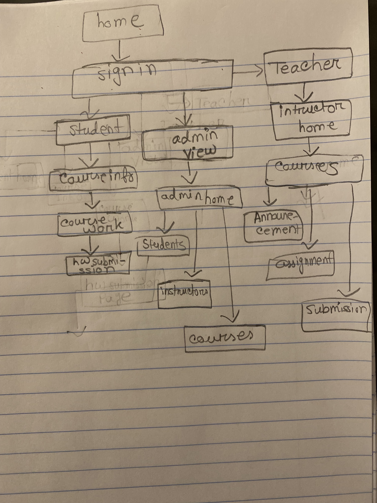

## Miss Prity Khatun

##### I have learned how to design wireframe and sitemap, before building any website it is important to layout the design first in this way you will know exactly how you want your webpage to look like. Also I have learned how to collaboratively work togeher using GitHub. My partner and I both disgussed how we want our chalkboard to look like and the specific parts for each student and instructor even for the admin. I have designed the wireframe for the students and the insructor and the admin. 

Ibnat Nuha 
I learned how to create sitemap and wireframe.By doing this I learned how important it is to have a visualization before we create our website, I have never drawn any wire frame before so the video helped me a lot to prepare for this assignment. I have also learned how to use markup in Read.me file. I have created site map for this assignment and part of the wire frame where I layout out the idea for home page of the website.

